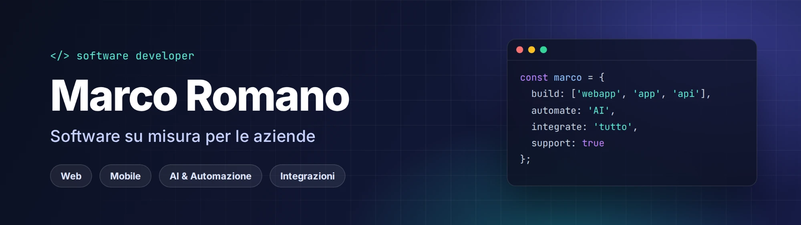

  

  
  
  

 

  Sviluppo il <b>software che serve al business delle aziende</b>: 
  le <b>piattaforme</b> su cui lavorano ogni giorno e i <b>tool</b> che risolvono un processo specifico. 
  Ne curo la <b>gestione nel tempo</b> e affianco le aziende nelle <b>scelte tecniche</b>.

 

## Servizi

| | Servizio | Cosa comprende |
|:-:|---|---|
| 🧩 | **Software su misura** | Analisi dei requisiti, progettazione di architettura e database, sviluppo frontend e backend, test, rilascio e documentazione |
| 📱 | **App mobile** | Progettazione UX/UI, sviluppo iOS e Android, integrazione con backend e servizi esterni, notifiche push, pubblicazione sugli store |
| 🤖 | **AI e automazione** | Analisi dei processi automatizzabili, integrazione di modelli linguistici, estrazione dati da documenti, agenti e workflow automatici, controllo di qualità e costi |
| 🔗 | **Integrazioni e API** | Progettazione e sviluppo di API, collegamento tra sistemi esistenti, sincronizzazione e migrazione dei dati, autenticazione e gestione degli errori |
| 🧰 | **Tool e prodotti** | Strumenti pronti all'uso in licenza: attivazione, configurazione, personalizzazioni, formazione e aggiornamenti |
| 🧭 | **Consulenza e direzione tecnica** | Analisi dello stato attuale, roadmap e priorità, scelta di tecnologie e fornitori, stima di costi e tempi, supervisione dei progetti |
| 🛠️ | **Manutenzione e gestione** | Aggiornamenti di sicurezza, hosting e deploy, backup e ripristino, monitoraggio, risoluzione dei problemi, piccole evoluzioni |

 

## Stack

| Area | Tecnologie |
|---|---|
| **Mobile** |  React &nbsp;  Flutter &nbsp;  Dart &nbsp;  Android Studio |
| **Frontend** |  TypeScript &nbsp;  JavaScript &nbsp;  React &nbsp;  Next.js &nbsp;  Vue |
| **Backend** |  Node.js &nbsp;  Express &nbsp;  NestJS &nbsp;  FastAPI &nbsp;  PHP |
| **Database** |  PostgreSQL &nbsp;  MySQL &nbsp;  MongoDB &nbsp;  Supabase &nbsp;  Firebase |
| **Cloud e DevOps** |  Docker &nbsp;  AWS &nbsp;  Google Cloud &nbsp;  Vercel &nbsp;  Cloudflare &nbsp;  GitHub Actions |
| **AI** |      |

 

---

  <b>Hai un progetto in mente?</b> 
  <a href="mailto:marcoromanoweb@gmail.com">marcoromanoweb@gmail.com</a>

